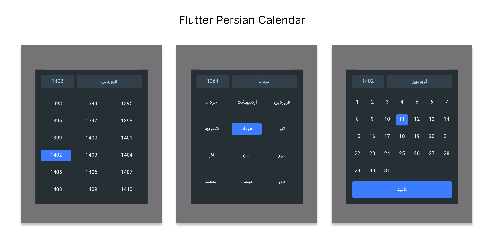
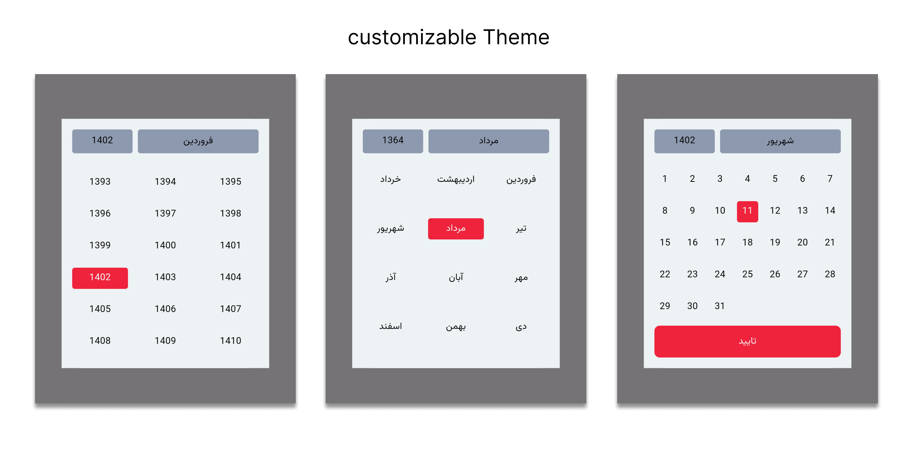

# Flutter Persian Calendar: A Widget for Jalali (Persian) Date Display



This Flutter package provides a simple and customizable Persian calendar widget for easy integration into your Flutter project. The package is based on [shamsi_date](https://pub.dev/packages/shamsi_date).

## Features

- **Filter Start and End Date:** You can add start-date and end-date to filter showing dates.
- **Customization Options:** Tailor the appearance of the calendar to fit your application's theme with customizable options.

## Usage

Add it to your pubspec.yaml file:

```yaml
dependencies:

persian_datetime_picker: ^0.0.1
```

In your library add the following import:

```dart

import  'package:flutter_persian_calendar/flutter_persian_calendar.dart';

```

check example to use:

```dart
 //Create a button to user tap on it and show calendar to select date
ElevatedButton(
   onPressed: () {
    //Show calendar in Dialog
     showDialog(
       context: context,
       builder: (context) {
         return Dialog(
           child:
               shamsiDateCalendarWidget(context, calendarDarkTheme),
         );
       },
     );
   },
   child: const Text('Select Date'),
 );

//Can create a base Calendar widget to show with different Themes
  PersianCalendar shamsiDateCalendarWidget(
    BuildContext context,
    //Pass different Theme
    PersianCalendarTheme calendarTheme,
  ) {
    return PersianCalendar(
      calendarHeight: 376,
      calendarWidth: 360,
      selectedDate: selectedDate,
      onDateChanged: (newDate) {
          selectedDate = newDate;
      },
      onConfirmButtonPressed: () {
        Navigator.pop(context);
      },
      datePickerStartDate: Jalali(1300, 4, 12),
      datePickerEndDate: Jalali(1402, 7, 10),
      calendarTheme: calendarTheme,
    );
  }

```

## Customization

You can change colors, textStyle, and the height and width of items in `PersianCalendarTheme`. Here is a customized lightTheme:

```dart
PersianCalendarTheme(
  backgroundColor: const Color(0XFFEDF2F4),
  selectedColor: const Color(0XFFEF233C),
  headerBackgroundColor: const Color(0XFF8D99AE),
  textStyle: const TextStyle(
    fontSize: 14,
    color: Colors.black,
  ),
  selectedItemTextStyle: const TextStyle(
    fontSize: 14,
    color: Color(0XFFF2F2F2),
  ),
  confirmButtonTextStyle: const TextStyle(
    fontSize: 14,
    color: Color(0XFFF2F2F2),
  ),
  headerTextStyle: const TextStyle(
    fontSize: 14,
    color: Colors.black,
  ),
);

```

Output screenshot:



## Contributions

We welcome contributions from the community! If you'd like to contribute to the development of Flutter Persian Calendar, please follow these guidelines:

### Reporting Issues

If you encounter any issues with the package or have suggestions for improvements, please open an issue on the [GitHub issue tracker](https://github.com/Amirnlz/flutter_persian_calendar/issues). When reporting issues, please provide detailed information about the problem, including steps to reproduce it and your environment (Flutter version, platform, etc.).

### Making Changes

1. Fork the repository.
2. Create a new branch for your feature or bug fix: `git checkout -b feature/my-feature` or `git checkout -b bugfix/fix-issue`.
3. Make your changes and test thoroughly.
4. Commit your changes: `git commit -m 'Add some feature'`.
5. Push to the branch: `git push origin feature/my-feature`.
6. Submit a pull request.

Feel free to use or modify this version based on your preferences!
